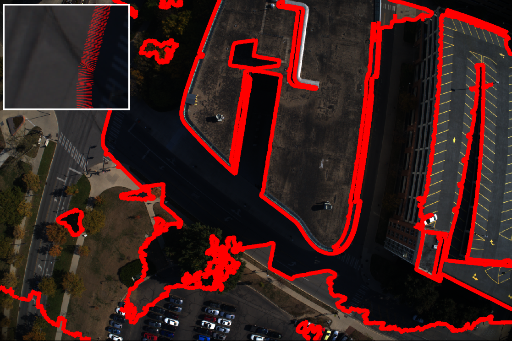

#### Create image dataset from Block Exchange format

``` bash
$ python scripts/step0_blockxml_to_imagedataset.py -h
usage: step0_blockxml_to_imagedataset.py [-h] [--default_redirect DEFAULT_REDIRECT [DEFAULT_REDIRECT ...]]
                                   [--default_utczone DEFAULT_UTCZONE]
                                   blockxml outjson

Convert ContextCapture block xml to image dataset json

positional arguments:
  blockxml              Path to block xml file
  outjson               Path to output json file

options:
  -h, --help            show this help message and exit
  --default_redirect DEFAULT_REDIRECT [DEFAULT_REDIRECT ...]
                        Redirect image path to a new folder
  --default_utczone DEFAULT_UTCZONE
                        UTC zone
```

Example:

``` bash
python scripts/step0_blockxml_to_imagedataset.py "/research/GDA/data/UAV_images/22Jan4-GoodalePark/Results/ContextCapture_OBJ/Block_1 - AT enu.xml" $workdir/imagedataset.json --default_redirect "/research/GDA/data/UAV_images/22Jan4-GoodalePark/RAW"
```

#### Create model dataset from ContextCapture Tiled OBJ format

``` bash
$ python scripts/step0_tiledobj_to_modeldataset.py -h
usage: step0_tiledobj_to_modeldataset.py [-h] input_folder output_json

Convert ContextCapture Tiled OBJ to Model dataset

positional arguments:
  input_folder   Input folder (ContextCapture Tiled OBJ)
  output_json    Output json path

options:
  -h, --help     show this help message and exit
```

Example:

``` bash
python scripts/step0_tiledobj_to_modeldataset.py /research/GDA/data/UAV_images/22Jan4-GoodalePark/Results/ContextCapture_OBJ $workdir/modeldataset.json 
```

### Step 1: Pull images into the working directory

``` bash
$ python scripts/step1_pull_images.py -h
usage: step1_pull_images.py [-h] [--nlevel NLEVEL] [--synthetic] input_folder

Create Thumbnail

positional arguments:
  input_folder     Input folder (ContextCapture Tiled OBJ)

options:
  -h, --help       show this help message and exit
  --nlevel NLEVEL  Downsample level
  --synthetic      Render thumbnail
```

Example:

``` bash
python scripts/step1_pull_images.py  $workdir --nlevel 3
```

Two subfolders will be created in the input folder: `image` and `thumbnail`.

### Step 2.1: Ambient Occlusion computation

``` bash
export workdir=... # working directory
./scripts/step2.1_ambient_occ_baker.sh
```

After running, a new folder `models` will be created in the working directory.

``` bash
models
├── aoprops.dat
├── dirsamples.json
├── model.glb
```


### Step 2.2: Render buffers

``` bash
export workdir=... # working directory
./scripts/step2.2_render_buffers.sh
```

### Step 3: Sun visibility buffer CRF refinement

``` bash
python scripts/step3_crf_sunvis_refinement.py $workdir
```

This script will create `sunvis/crf` folder in the working directory. Sun visibility buffer will be transformed to a binary mask. Note: the original sun visibility buffer has 3 states: 255 (sun visible), 50 (sun occluded), 0 (nodata). The script will transform the buffer to a binary mask: 255 (sun visible), 0 (sun occluded).


### Step 4: Sample lit-shadow pairs from a narrow band along the shadow boundary


```bash
$ python scripts/step4_sample_litshadow_band.py -h      
usage: step4_sample_litshadow_band.py [-h] [--radius RADIUS] input_folder

Sample Lit Shadow Band

positional arguments:
  input_folder     Input folder (ContextCapture Tiled OBJ)

options:
  -h, --help       show this help message and exit
  --radius RADIUS  Radius of sampling
```


Given the sun visibility buffer, this script will sample a narrow band along the shadow boundary. The band is defined by the sun visibility buffer and the shadow boundary. The band is sampled with a fixed width of 5 (default) pixels. The sampled band will be saved in the working directory as `litshadow_band.png`.

Example:
``` bash
python scripts/step4_sample_litshadow_band.py $workdir
```




### Step 5: Process lit-shadow pairs

``` bash
python scripts/step5_process_litshadow_band.py $workdir
```

### Step 6: Compute Sun-Sky intensity ratio from the sky model

Example:
``` bash
python scripts/step6_compute_sunsky_ratio.py --skymodel AO --logarithm_phi $workdir 
```

### Step 7: Compute Albedo

Example:

``` bash
python scripts/step7_decompose_albedo.py --median_phi $workdir $workdir/export
```

### Step 8: Undistort image (optional)

For some applications like texture mapping, user may need undistorted images.


``` bash
python scripts/step8_undistortion.py $workdir/imagedataset.json  $workdir/export_ao_logarithm --gammar_correction
```
